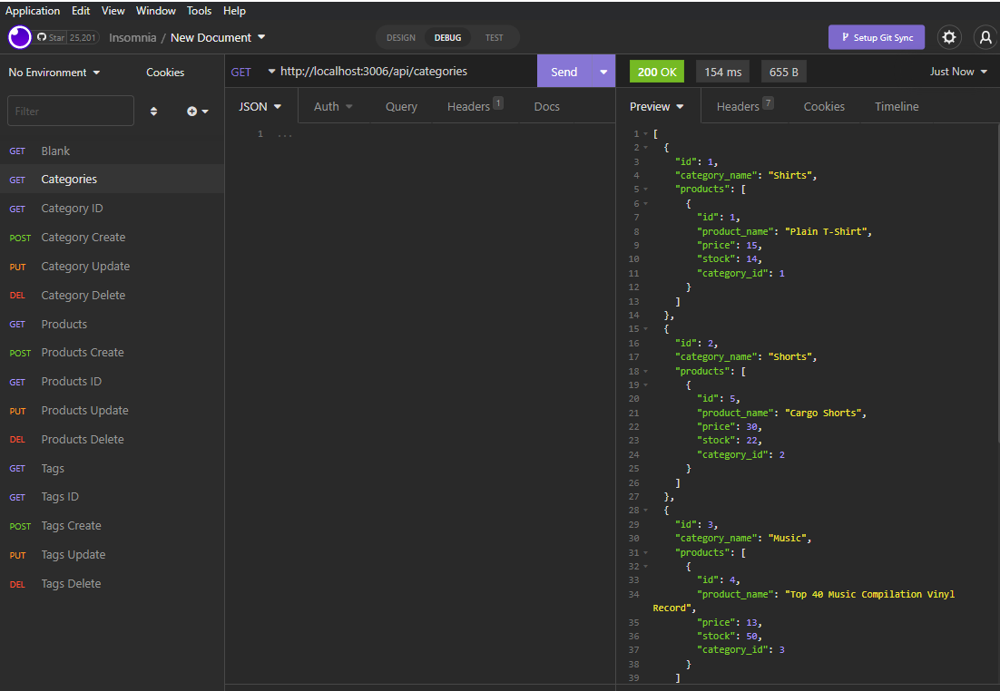
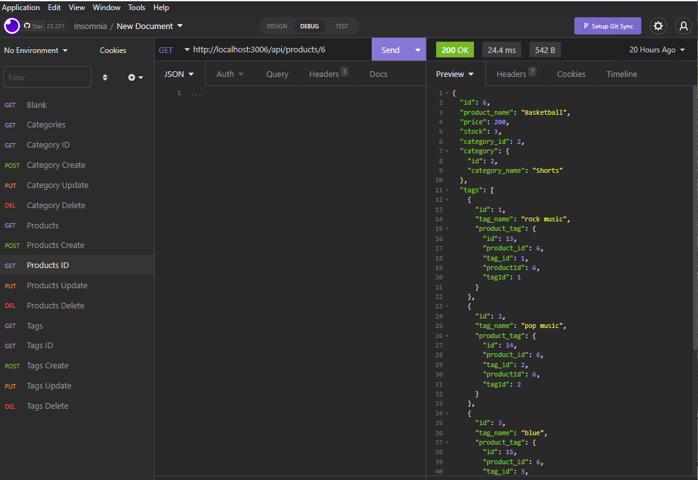
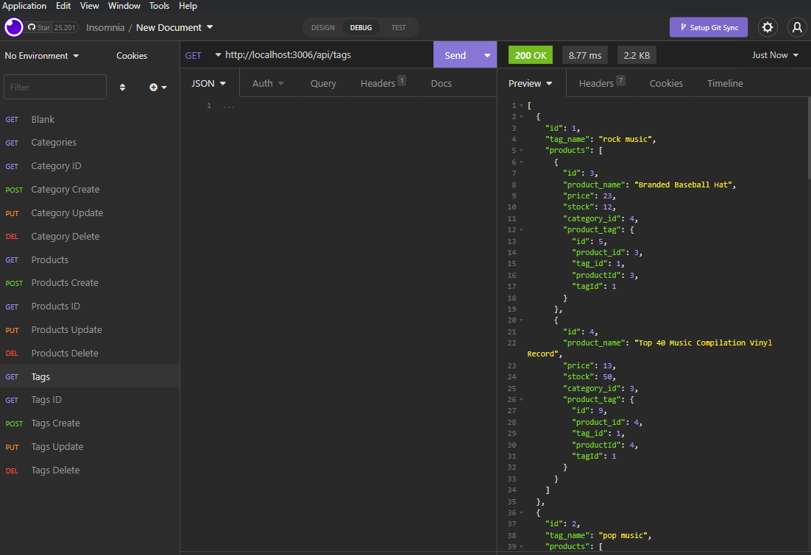

# Object-Relational Mapping (ORM): E-Commerce Back End

## Table of Contents 
- [Application Image](#application-image)
- [Installation Instructions](#installation)
- [Instructions](#instructions--usage)
- [Usage Video](#usage-video)
- [License](#license)
- [Questions](#questions)

## Application Image 

## Installation Instructions
To install the application, you would download the e-commerceBackEnd repository (https://github.com/MicheleTornetta/e-commerceBackEnd).  User will need to download and install the MySql developer addition.  From there you would navigate to the directory in the command terminal.  Once there the user will need to type in "npm i" to download the dependencies. 

## Instructions
Once dependecies are dowloaded, user will want to run the server by typing node server in the terminal.  User will want to install Insomia and or MySQL Workbench to add catagories, products, and tages.  User can also update and delete items as needed.  User will be able to use the GET, POST, PUT, DEL methods to keep the database current.  

## Usage Video
An example of how it works can be viewed here: 

## License 
A short, permissive software license. Basically, you can do whatever you want as long as you include the original copyright and license notice in any copy of the software/source.  There are many variations of this license in use.

## Questions
If you would like to contribute or you simply have questions, please visit: 

https://github.com/MicheleTornetta

or email me at:
mlt@pwahsolutions.com
